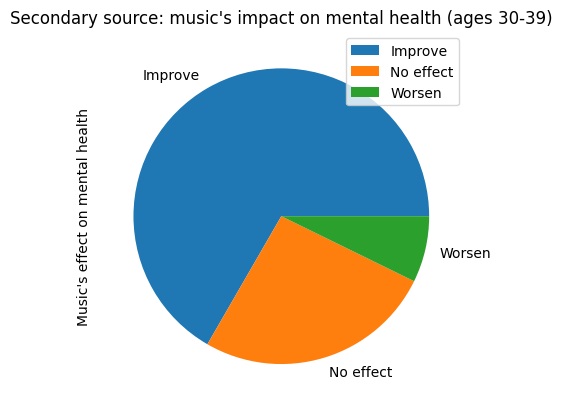
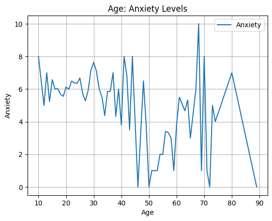

# Music and Mental Health
**Do you listen to music? Have you ever wondered if it impacts your mental health?! Learn all about it in our lovely notebook! :)**

We firstly imported a dataset found on Github called "Music and Mental Health" as our secondary source.
This dataset is a survey, meaning that the values are measured by the respondent (self-reported). It has 24,321 data points. 

<table border="1" class="dataframe">
  <thead>
    <tr style="text-align: right;">
      <th></th>
      <th>Timestamp</th>
      <th>Age</th>
      <th>Primary streaming service</th>
      <th>Hours per day</th>
      <th>While working</th>
      <th>Instrumentalist</th>
      <th>Composer</th>
      <th>Fav genre</th>
      <th>Exploratory</th>
      <th>Foreign languages</th>
      <th>...</th>
      <th>Frequency [R&amp;B]</th>
      <th>Frequency [Rap]</th>
      <th>Frequency [Rock]</th>
      <th>Frequency [Video game music]</th>
      <th>Anxiety</th>
      <th>Depression</th>
      <th>Insomnia</th>
      <th>OCD</th>
      <th>Music effects</th>
      <th>Permissions</th>
    </tr>
  </thead>
  <tbody>
    <tr>
      <th>0</th>
      <td>8/27/2022 19:29:02</td>
      <td>18.0</td>
      <td>Spotify</td>
      <td>3.0</td>
      <td>Yes</td>
      <td>Yes</td>
      <td>Yes</td>
      <td>Latin</td>
      <td>Yes</td>
      <td>Yes</td>
      <td>...</td>
      <td>Sometimes</td>
      <td>Very frequently</td>
      <td>Never</td>
      <td>Sometimes</td>
      <td>3.0</td>
      <td>0.0</td>
      <td>1.0</td>
      <td>0.0</td>
      <td>NaN</td>
      <td>I understand.</td>
    </tr>
    <tr>
      <th>1</th>
      <td>8/27/2022 19:57:31</td>
      <td>63.0</td>
      <td>Pandora</td>
      <td>1.5</td>
      <td>Yes</td>
      <td>No</td>
      <td>No</td>
      <td>Rock</td>
      <td>Yes</td>
      <td>No</td>
      <td>...</td>
      <td>Sometimes</td>
      <td>Rarely</td>
      <td>Very frequently</td>
      <td>Rarely</td>
      <td>7.0</td>
      <td>2.0</td>
      <td>2.0</td>
      <td>1.0</td>
      <td>NaN</td>
      <td>I understand.</td>
    </tr>
    <tr>
      <th>2</th>
      <td>8/27/2022 21:28:18</td>
      <td>18.0</td>
      <td>Spotify</td>
      <td>4.0</td>
      <td>No</td>
      <td>No</td>
      <td>No</td>
      <td>Video game music</td>
      <td>No</td>
      <td>Yes</td>
      <td>...</td>
      <td>Never</td>
      <td>Rarely</td>
      <td>Rarely</td>
      <td>Very frequently</td>
      <td>7.0</td>
      <td>7.0</td>
      <td>10.0</td>
      <td>2.0</td>
      <td>No effect</td>
      <td>I understand.</td>
    </tr>
    <tr>
      <th>3</th>
      <td>8/27/2022 21:40:40</td>
      <td>61.0</td>
      <td>YouTube Music</td>
      <td>2.5</td>
      <td>Yes</td>
      <td>No</td>
      <td>Yes</td>
      <td>Jazz</td>
      <td>Yes</td>
      <td>Yes</td>
      <td>...</td>
      <td>Sometimes</td>
      <td>Never</td>
      <td>Never</td>
      <td>Never</td>
      <td>9.0</td>
      <td>7.0</td>
      <td>3.0</td>
      <td>3.0</td>
      <td>Improve</td>
      <td>I understand.</td>
    </tr>
    <tr>
      <th>4</th>
      <td>8/27/2022 21:54:47</td>
      <td>18.0</td>
      <td>Spotify</td>
      <td>4.0</td>
      <td>Yes</td>
      <td>No</td>
      <td>No</td>
      <td>R&amp;B</td>
      <td>Yes</td>
      <td>No</td>
      <td>...</td>
      <td>Very frequently</td>
      <td>Very frequently</td>
      <td>Never</td>
      <td>Rarely</td>
      <td>7.0</td>
      <td>2.0</td>
      <td>5.0</td>
      <td>9.0</td>
      <td>Improve</td>
      <td>I understand.</td>
    </tr>
    <tr>
      <th>...</th>
      <td>...</td>
      <td>...</td>
      <td>...</td>
      <td>...</td>
      <td>...</td>
      <td>...</td>
      <td>...</td>
      <td>...</td>
      <td>...</td>
      <td>...</td>
      <td>...</td>
      <td>...</td>
      <td>...</td>
      <td>...</td>
      <td>...</td>
      <td>...</td>
      <td>...</td>
      <td>...</td>
      <td>...</td>
      <td>...</td>
      <td>...</td>
    </tr>
    <tr>
      <th>731</th>
      <td>10/30/2022 14:37:28</td>
      <td>17.0</td>
      <td>Spotify</td>
      <td>2.0</td>
      <td>Yes</td>
      <td>Yes</td>
      <td>No</td>
      <td>Rock</td>
      <td>Yes</td>
      <td>Yes</td>
      <td>...</td>
      <td>Never</td>
      <td>Rarely</td>
      <td>Very frequently</td>
      <td>Never</td>
      <td>7.0</td>
      <td>6.0</td>
      <td>0.0</td>
      <td>9.0</td>
      <td>Improve</td>
      <td>I understand.</td>
    </tr>
    <tr>
      <th>732</th>
      <td>11/1/2022 22:26:42</td>
      <td>18.0</td>
      <td>Spotify</td>
      <td>1.0</td>
      <td>Yes</td>
      <td>Yes</td>
      <td>No</td>
      <td>Pop</td>
      <td>Yes</td>
      <td>Yes</td>
      <td>...</td>
      <td>Never</td>
      <td>Never</td>
      <td>Sometimes</td>
      <td>Sometimes</td>
      <td>3.0</td>
      <td>2.0</td>
      <td>2.0</td>
      <td>5.0</td>
      <td>Improve</td>
      <td>I understand.</td>
    </tr>
    <tr>
      <th>733</th>
      <td>11/3/2022 23:24:38</td>
      <td>19.0</td>
      <td>Other streaming service</td>
      <td>6.0</td>
      <td>Yes</td>
      <td>No</td>
      <td>Yes</td>
      <td>Rap</td>
      <td>Yes</td>
      <td>No</td>
      <td>...</td>
      <td>Sometimes</td>
      <td>Sometimes</td>
      <td>Rarely</td>
      <td>Rarely</td>
      <td>2.0</td>
      <td>2.0</td>
      <td>2.0</td>
      <td>2.0</td>
      <td>Improve</td>
      <td>I understand.</td>
    </tr>
    <tr>
      <th>734</th>
      <td>11/4/2022 17:31:47</td>
      <td>19.0</td>
      <td>Spotify</td>
      <td>5.0</td>
      <td>Yes</td>
      <td>Yes</td>
      <td>No</td>
      <td>Classical</td>
      <td>No</td>
      <td>No</td>
      <td>...</td>
      <td>Never</td>
      <td>Never</td>
      <td>Never</td>
      <td>Sometimes</td>
      <td>2.0</td>
      <td>3.0</td>
      <td>2.0</td>
      <td>1.0</td>
      <td>Improve</td>
      <td>I understand.</td>
    </tr>
    <tr>
      <th>735</th>
      <td>11/9/2022 1:55:20</td>
      <td>29.0</td>
      <td>YouTube Music</td>
      <td>2.0</td>
      <td>Yes</td>
      <td>No</td>
      <td>No</td>
      <td>Hip hop</td>
      <td>Yes</td>
      <td>Yes</td>
      <td>...</td>
      <td>Very frequently</td>
      <td>Very frequently</td>
      <td>Very frequently</td>
      <td>Rarely</td>
      <td>2.0</td>
      <td>2.0</td>
      <td>2.0</td>
      <td>5.0</td>
      <td>Improve</td>
      <td>I understand.</td>
    </tr>
  </tbody>
</table>

736 rows × 33 columns

We then imported our primary source, a Google form that we made and shared with those we know.

<table border="1" class="dataframe">
  <thead>
    <tr style="text-align: right;">
      <th></th>
      <th>Timestamp</th>
      <th>How old are you?</th>
      <th>How many hours of music do you listen to each day on average? (ex. 3)</th>
      <th>What music genre do you listen to the most?</th>
      <th>How would you rate your anxiety level?</th>
      <th>How would you rate your depression level?</th>
      <th>How would you rate your insomnia level?</th>
      <th>How would you rate your OCD level?</th>
      <th>Have you experienced decreased attention spans after listening to music?</th>
      <th>Have you found it hard to remember/memorize after listening to music?</th>
      <th>If you listen to music while going to sleep, do you find it easier to sleep? (skip if you do not listen to music while sleeping)</th>
      <th>Do you think listening to music while exercising helps with your work out? (skip if you do not listen to music while working out)</th>
      <th>@dropdown</th>
    </tr>
  </thead>
  <tbody>
    <tr>
      <th>0</th>
      <td>7/17/2025 9:42:55</td>
      <td>10s</td>
      <td>0</td>
      <td>R&amp;B</td>
      <td>3</td>
      <td>6</td>
      <td>5</td>
      <td>1</td>
      <td>Yes</td>
      <td>No</td>
      <td>NaN</td>
      <td>Yes</td>
      <td>NaN</td>
    </tr>
    <tr>
      <th>1</th>
      <td>7/17/2025 9:43:38</td>
      <td>10s</td>
      <td>1</td>
      <td>Rap</td>
      <td>1</td>
      <td>2</td>
      <td>1</td>
      <td>3</td>
      <td>No</td>
      <td>No</td>
      <td>NaN</td>
      <td>NaN</td>
      <td>NaN</td>
    </tr>
    <tr>
      <th>2</th>
      <td>7/17/2025 9:43:57</td>
      <td>10s</td>
      <td>3</td>
      <td>Rock</td>
      <td>3</td>
      <td>2</td>
      <td>4</td>
      <td>4</td>
      <td>Yes</td>
      <td>No</td>
      <td>Yes</td>
      <td>NaN</td>
      <td>NaN</td>
    </tr>
    <tr>
      <th>3</th>
      <td>7/17/2025 9:44:07</td>
      <td>10s</td>
      <td>2</td>
      <td>Pop</td>
      <td>3</td>
      <td>2</td>
      <td>1</td>
      <td>2</td>
      <td>No</td>
      <td>No</td>
      <td>Yes</td>
      <td>Yes</td>
      <td>NaN</td>
    </tr>
    <tr>
      <th>4</th>
      <td>7/17/2025 9:44:10</td>
      <td>10s</td>
      <td>3</td>
      <td>Pop</td>
      <td>6</td>
      <td>5</td>
      <td>8</td>
      <td>7</td>
      <td>Yes</td>
      <td>No</td>
      <td>Yes</td>
      <td>Yes</td>
      <td>NaN</td>
    </tr>
    <tr>
      <th>...</th>
      <td>...</td>
      <td>...</td>
      <td>...</td>
      <td>...</td>
      <td>...</td>
      <td>...</td>
      <td>...</td>
      <td>...</td>
      <td>...</td>
      <td>...</td>
      <td>...</td>
      <td>...</td>
      <td>...</td>
    </tr>
    <tr>
      <th>103</th>
      <td>7/17/2025 13:40:19</td>
      <td>10s</td>
      <td>3</td>
      <td>Rock</td>
      <td>3</td>
      <td>2</td>
      <td>2</td>
      <td>2</td>
      <td>No</td>
      <td>No</td>
      <td>NaN</td>
      <td>Yes</td>
      <td>NaN</td>
    </tr>
    <tr>
      <th>104</th>
      <td>7/17/2025 13:41:56</td>
      <td>20s</td>
      <td>3</td>
      <td>Pop</td>
      <td>6</td>
      <td>6</td>
      <td>4</td>
      <td>3</td>
      <td>Yes</td>
      <td>Yes</td>
      <td>No</td>
      <td>No</td>
      <td>NaN</td>
    </tr>
    <tr>
      <th>105</th>
      <td>7/17/2025 13:42:45</td>
      <td>20s</td>
      <td>2</td>
      <td>Pop</td>
      <td>8</td>
      <td>5</td>
      <td>2</td>
      <td>1</td>
      <td>No</td>
      <td>No</td>
      <td>No</td>
      <td>Yes</td>
      <td>NaN</td>
    </tr>
    <tr>
      <th>106</th>
      <td>7/17/2025 14:01:00</td>
      <td>10s</td>
      <td>3</td>
      <td>Rock</td>
      <td>8</td>
      <td>3</td>
      <td>1</td>
      <td>2</td>
      <td>No</td>
      <td>No</td>
      <td>Yes</td>
      <td>Yes</td>
      <td>NaN</td>
    </tr>
    <tr>
      <th>107</th>
      <td>7/17/2025 14:19:54</td>
      <td>10s</td>
      <td>4</td>
      <td>Rock</td>
      <td>4</td>
      <td>2</td>
      <td>3</td>
      <td>4</td>
      <td>No</td>
      <td>No</td>
      <td>NaN</td>
      <td>Yes</td>
      <td>NaN</td>
    </tr>
  </tbody>
</table>

108 rows × 13 columns

The first question we asked ourselves was: 
## 1. Which music genre seems to be the most effective in improving anxiety? And the least effective?

We first analyzed the data from our secondary source.

    <Axes: title={'center': 'Fav genre: Average Mental Health Indicator Levels (Secondary)'}, xlabel='Fav genre', ylabel='Average level'>

    

    

As we can see in this graph, there is **little to no relation** between favorite music genre and average level of mental health conditions. However, people who reported listening to **Gospel** indicated having **lower levels** of **depression and OCD.** Therefore, gospel music is particularly useful to alleviate and relax mental health. On the contrary, there is no least effective music genre as they all showed very close results.

Here are the results from our primary source for the same question asked above. We did this to double-check our results. 

    <Axes: title={'center': 'Fav genre: Average Mental Health Indicator Levels (Primary)'}, xlabel='Fav genre', ylabel='Average level'>

    

    

Our findings from our primary source indicate that overall **jazz ranked the lowest in anxiety, depression, insomnia, and OCD.** **Country music ranked the highest in anxiety and OCD levels. EDM ranked the highest in depression levels and tied with folk for high insomnia levels.**
This **contrasted** from our findings from the secondary source that highlighted **Gospel** as the music genre with the lowest depression and OCD levels. 
An uncertainty for both of the findings could lie in the number of people who chose a particular genre which led to misrepresentations. For example, we might have gotten fewer responses for less popular music genres such as EDM and folk which is why they have much higher mental health indicator levels compared to those who got more responses. 

## 2. Do composers tend to have better mental health than those who just listen to music?

    <Axes: title={'center': 'Composer/Not Composer: Mental Health'}, xlabel='Composer or not?', ylabel='Average level'>

    

    

Our conclusion about this question is that while the anxiety and depression levels between composers and non-composers is similar, the depression and insomnia levels were higher in composers. 

## 3. Does listening to music while working impact anxiety? 

<table border="1" class="dataframe">
  <thead>
    <tr style="text-align: right;">
      <th></th>
      <th>Anxiety</th>
      <th>Music while working (Yes)</th>
      <th>Music while working (No)</th>
    </tr>
  </thead>
  <tbody>
    <tr>
      <th>0</th>
      <td>0.0</td>
      <td>27</td>
      <td>8</td>
    </tr>
    <tr>
      <th>1</th>
      <td>1.0</td>
      <td>19</td>
      <td>10</td>
    </tr>
    <tr>
      <th>2</th>
      <td>2.0</td>
      <td>40</td>
      <td>4</td>
    </tr>
    <tr>
      <th>3</th>
      <td>3.0</td>
      <td>46</td>
      <td>23</td>
    </tr>
    <tr>
      <th>4</th>
      <td>4.0</td>
      <td>42</td>
      <td>13</td>
    </tr>
    <tr>
      <th>5</th>
      <td>5.0</td>
      <td>46</td>
      <td>13</td>
    </tr>
    <tr>
      <th>6</th>
      <td>6.0</td>
      <td>73</td>
      <td>10</td>
    </tr>
    <tr>
      <th>7</th>
      <td>7.0</td>
      <td>101</td>
      <td>21</td>
    </tr>
    <tr>
      <th>8</th>
      <td>8.0</td>
      <td>87</td>
      <td>28</td>
    </tr>
    <tr>
      <th>9</th>
      <td>9.0</td>
      <td>46</td>
      <td>9</td>
    </tr>
    <tr>
      <th>10</th>
      <td>10.0</td>
      <td>51</td>
      <td>15</td>
    </tr>
  </tbody>
</table>

    

    

However, this chart proved to be a misleading way to view the data, especially as the x-axis and y-axis were not correctly chosen. As a result, we attempted a different approach. 

    <Axes: title={'center': 'Music While Working (Yes/No): Anxiety Levels'}, xlabel='Music while working?', ylabel='Average level'>

    

    

The second graph is more accurate than the first one because it correctly places the independent and dependent values on the x-axis and y-axis, respectively. This leads to the accurate conclusion that whether or not a person listens to music while working does not affect their anxiety levels. 

## 4. What is the relationship between the age of the listener and the effects of music on their mental health?

This is an interesting question, since three parameters are being analyzed simultaneously which are age, music, and mental health.

We first made a scatter plot as we wondered how many hours of music is listened to per day, by each age group.  

    <Axes: title={'center': 'Age: Listened Hours Per Day'}, xlabel='Age', ylabel='Hours per day'>

    

    

It seems that the younger the person is, the more music they tend to listen to. However, because of the high number of young respondents, it is harder to determine the distribution.

We then began exploring the exact age distribution among the respondents to see just how many younger ones there were.

    <Axes: title={'center': 'Secondary source: age distribution'}, ylabel='Ages'>

    

    

As we can see, the ages of the respondents tend to be younger, with almost half being less than 19 years old.

    <Axes: title={'center': 'Primary source: age distribution'}, ylabel='Age'>

    

    

The age distribution in our primary source is relatively similar.

Let's now look at the distribution of people who believed that music either **improved, worsened, or had no effect** on their mental health.

    <Axes: title={'center': "Secondary source: music's impact on mental health"}, ylabel="Music's effect on mental health">

    

    

It's clear that the majority (around 3/4) of the respondents believe that listening to music improves their mental wellbeing. In that case, let us compare the responses to this same question by age group. Considering how the younger respondents seem to have higher listening hours per day, perhaps more of them think doing so improves their mental health. Or could it be the other way around?

In order to do this comparison, we made several pie charts, one for each age group. 

    <Axes: title={'center': "Secondary source: music's impact on mental health (ages 60 and up)"}, ylabel="Music's effect on mental health">

    

    

    

    

    

    

    

    

    

    

    

    

    

    

Through the pie charts that we made, we can see a possible relationship between **age and the effect of music on their mental health.** Most people (of all ages) see music as something that benefits their mental health, but this is especially true with younger people. The highest percentage of people who thought music benefitted their mental health was in the 12 and under age range, and this percentage generally decreased as age group increased. 

## 5. Does listening to music help with sleep?

Since many of us fall asleep to music, we wondered if maybe listening to music had adverse effects on our quality of sleep. So, we compared the daily listening hours with the levels of insomnia. 

    <Axes: title={'center': 'Listened Hours Per Day: Insomnia Levels'}, xlabel='Hours per day'>

    

    

The results of this bar chart do not show a very clear pattern. It is hard to determine much but we can remark a few peaks in certain areas, such as at 13 and 20 hours a day.

Here we can take a look at the primary source data results for this same question.

    <Axes: ylabel='Does music help you sleep?'>

    

    

The majority of respondents answered yes.

## 6. Do instrumentalists tend to have insomnia?

On the subject of insomnia, we also wondered if instrumentalists had higher levels of it since they... *play their instruments till the dead of night!*

    <Axes: title={'center': 'Instrumentalist/Not Instrumentalist: Insomnia Levels'}, xlabel='Instrumentalist'>

    

    

From the graph above, we concluded that instrumentalists *do* seem to have slightly higher levels of insomnia.

## 7. Is there a relationship between the number of hours spent listening to music and adverse mental health indicators?

Next, we wondered if listening to more or less music per day had an effect on the mental health indicator levels.

<table border="1" class="dataframe">
  <thead>
    <tr style="text-align: right;">
      <th></th>
      <th>Timestamp</th>
      <th>How old are you?</th>
      <th>How many hours of music do you listen to each day on average? (ex. 3)</th>
      <th>What music genre do you listen to the most?</th>
      <th>How would you rate your anxiety level?</th>
      <th>How would you rate your depression level?</th>
      <th>How would you rate your insomnia level?</th>
      <th>How would you rate your OCD level?</th>
      <th>Have you experienced decreased attention spans after listening to music?</th>
      <th>Have you found it hard to remember/memorize after listening to music?</th>
      <th>If you listen to music while going to sleep, do you find it easier to sleep? (skip if you do not listen to music while sleeping)</th>
      <th>Do you think listening to music while exercising helps with your work out? (skip if you do not listen to music while working out)</th>
      <th>@dropdown</th>
    </tr>
  </thead>
  <tbody>
    <tr>
      <th>0</th>
      <td>7/17/2025 9:42:55</td>
      <td>Teen</td>
      <td>0</td>
      <td>R&amp;B</td>
      <td>3</td>
      <td>6</td>
      <td>5</td>
      <td>1</td>
      <td>Yes</td>
      <td>No</td>
      <td>NaN</td>
      <td>Yes</td>
      <td>NaN</td>
    </tr>
    <tr>
      <th>1</th>
      <td>7/17/2025 9:43:38</td>
      <td>Teen</td>
      <td>1</td>
      <td>Rap</td>
      <td>1</td>
      <td>2</td>
      <td>1</td>
      <td>3</td>
      <td>No</td>
      <td>No</td>
      <td>NaN</td>
      <td>NaN</td>
      <td>NaN</td>
    </tr>
    <tr>
      <th>2</th>
      <td>7/17/2025 9:43:57</td>
      <td>Teen</td>
      <td>3</td>
      <td>Rock</td>
      <td>3</td>
      <td>2</td>
      <td>4</td>
      <td>4</td>
      <td>Yes</td>
      <td>No</td>
      <td>Yes</td>
      <td>NaN</td>
      <td>NaN</td>
    </tr>
    <tr>
      <th>3</th>
      <td>7/17/2025 9:44:07</td>
      <td>Teen</td>
      <td>2</td>
      <td>Pop</td>
      <td>3</td>
      <td>2</td>
      <td>1</td>
      <td>2</td>
      <td>No</td>
      <td>No</td>
      <td>Yes</td>
      <td>Yes</td>
      <td>NaN</td>
    </tr>
    <tr>
      <th>4</th>
      <td>7/17/2025 9:44:10</td>
      <td>Teen</td>
      <td>3</td>
      <td>Pop</td>
      <td>6</td>
      <td>5</td>
      <td>8</td>
      <td>7</td>
      <td>Yes</td>
      <td>No</td>
      <td>Yes</td>
      <td>Yes</td>
      <td>NaN</td>
    </tr>
    <tr>
      <th>...</th>
      <td>...</td>
      <td>...</td>
      <td>...</td>
      <td>...</td>
      <td>...</td>
      <td>...</td>
      <td>...</td>
      <td>...</td>
      <td>...</td>
      <td>...</td>
      <td>...</td>
      <td>...</td>
      <td>...</td>
    </tr>
    <tr>
      <th>114</th>
      <td>7/17/2025 17:16:18</td>
      <td>13-19</td>
      <td>5</td>
      <td>Pop</td>
      <td>3</td>
      <td>5</td>
      <td>9</td>
      <td>2</td>
      <td>No</td>
      <td>No</td>
      <td>Yes</td>
      <td>NaN</td>
      <td>NaN</td>
    </tr>
    <tr>
      <th>115</th>
      <td>7/17/2025 17:53:26</td>
      <td>13-19</td>
      <td>1</td>
      <td>Hip-Hop</td>
      <td>8</td>
      <td>4</td>
      <td>1</td>
      <td>8</td>
      <td>No</td>
      <td>No</td>
      <td>NaN</td>
      <td>Yes</td>
      <td>NaN</td>
    </tr>
    <tr>
      <th>116</th>
      <td>7/17/2025 17:54:43</td>
      <td>13-19</td>
      <td>0</td>
      <td>R&amp;B</td>
      <td>6</td>
      <td>4</td>
      <td>10</td>
      <td>7</td>
      <td>No</td>
      <td>No</td>
      <td>Yes</td>
      <td>Yes</td>
      <td>NaN</td>
    </tr>
    <tr>
      <th>117</th>
      <td>7/17/2025 18:47:05</td>
      <td>13-19</td>
      <td>1</td>
      <td>Rap</td>
      <td>2</td>
      <td>1</td>
      <td>1</td>
      <td>1</td>
      <td>No</td>
      <td>No</td>
      <td>NaN</td>
      <td>Yes</td>
      <td>NaN</td>
    </tr>
    <tr>
      <th>118</th>
      <td>7/17/2025 18:56:06</td>
      <td>13-19</td>
      <td>4</td>
      <td>Hip-Hop</td>
      <td>2</td>
      <td>1</td>
      <td>3</td>
      <td>1</td>
      <td>Yes</td>
      <td>Yes</td>
      <td>NaN</td>
      <td>Yes</td>
      <td>NaN</td>
    </tr>
  </tbody>
</table>

119 rows × 13 columns

    <Axes: title={'center': 'Listened Hours Per Day: Mental Indicator Levels'}, xlabel='Hours per day', ylabel='Average levels of adverse mental health indicators'>

    

    

Although the data is skewed to the left, a signficant finding is that listening to music for 7 hours led to higher levels of anxiety and OCD levels while listening to music for 6 hours had the lowest OCD level. 

## 8. Do people using different streaming services have different levels of anxiety?

Finally, we wondered what the differences in mental health could be between people using different streaming services. After some testing, anxiety seems to be the most interesting indicator to analyze in this case.

    <Axes: title={'center': 'Streaming Service: Anxiety Levels'}, xlabel='Streaming service', ylabel='Average level'>

    

    

People who use Apple Music seem to have higher anxiety levels while Pandora users have lower.
We wondered why that is and decided to look into the average age range of the different streaming platform users.

    <Axes: title={'center': 'Streaming Service: Age'}, xlabel='Streaming service', ylabel='Age'>

    

    

As we can see here, Apple Music users tend to be younger while Pandora users are older. **Could there be a correlation between anxiety levels and age?**

    <Axes: title={'center': 'Age: Anxiety Levels'}, xlabel='Age', ylabel='Anxiety'>

    

    

It is a bit more difficult to correlate the two variables here, but we can see that the anxiety levels for the 50s to 60s range are significantly lower.
**Let's take a look at this same chart with our primary source.**

<table border="1" class="dataframe">
  <thead>
    <tr style="text-align: right;">
      <th></th>
      <th>Timestamp</th>
      <th>How old are you?</th>
      <th>How many hours of music do you listen to each day on average? (ex. 3)</th>
      <th>What music genre do you listen to the most?</th>
      <th>How would you rate your anxiety level?</th>
      <th>How would you rate your depression level?</th>
      <th>How would you rate your insomnia level?</th>
      <th>How would you rate your OCD level?</th>
      <th>Have you experienced decreased attention spans after listening to music?</th>
      <th>Have you found it hard to remember/memorize after listening to music?</th>
      <th>If you listen to music while going to sleep, do you find it easier to sleep? (skip if you do not listen to music while sleeping)</th>
      <th>Do you think listening to music while exercising helps with your work out? (skip if you do not listen to music while working out)</th>
      <th>@dropdown</th>
    </tr>
  </thead>
  <tbody>
    <tr>
      <th>0</th>
      <td>7/17/2025 9:42:55</td>
      <td>10s</td>
      <td>0</td>
      <td>R&amp;B</td>
      <td>3</td>
      <td>6</td>
      <td>5</td>
      <td>1</td>
      <td>Yes</td>
      <td>No</td>
      <td>NaN</td>
      <td>Yes</td>
      <td>NaN</td>
    </tr>
    <tr>
      <th>1</th>
      <td>7/17/2025 9:43:38</td>
      <td>10s</td>
      <td>1</td>
      <td>Rap</td>
      <td>1</td>
      <td>2</td>
      <td>1</td>
      <td>3</td>
      <td>No</td>
      <td>No</td>
      <td>NaN</td>
      <td>NaN</td>
      <td>NaN</td>
    </tr>
    <tr>
      <th>2</th>
      <td>7/17/2025 9:43:57</td>
      <td>10s</td>
      <td>3</td>
      <td>Rock</td>
      <td>3</td>
      <td>2</td>
      <td>4</td>
      <td>4</td>
      <td>Yes</td>
      <td>No</td>
      <td>Yes</td>
      <td>NaN</td>
      <td>NaN</td>
    </tr>
    <tr>
      <th>3</th>
      <td>7/17/2025 9:44:07</td>
      <td>10s</td>
      <td>2</td>
      <td>Pop</td>
      <td>3</td>
      <td>2</td>
      <td>1</td>
      <td>2</td>
      <td>No</td>
      <td>No</td>
      <td>Yes</td>
      <td>Yes</td>
      <td>NaN</td>
    </tr>
    <tr>
      <th>4</th>
      <td>7/17/2025 9:44:10</td>
      <td>10s</td>
      <td>3</td>
      <td>Pop</td>
      <td>6</td>
      <td>5</td>
      <td>8</td>
      <td>7</td>
      <td>Yes</td>
      <td>No</td>
      <td>Yes</td>
      <td>Yes</td>
      <td>NaN</td>
    </tr>
    <tr>
      <th>...</th>
      <td>...</td>
      <td>...</td>
      <td>...</td>
      <td>...</td>
      <td>...</td>
      <td>...</td>
      <td>...</td>
      <td>...</td>
      <td>...</td>
      <td>...</td>
      <td>...</td>
      <td>...</td>
      <td>...</td>
    </tr>
    <tr>
      <th>103</th>
      <td>7/17/2025 13:40:19</td>
      <td>10s</td>
      <td>3</td>
      <td>Rock</td>
      <td>3</td>
      <td>2</td>
      <td>2</td>
      <td>2</td>
      <td>No</td>
      <td>No</td>
      <td>NaN</td>
      <td>Yes</td>
      <td>NaN</td>
    </tr>
    <tr>
      <th>104</th>
      <td>7/17/2025 13:41:56</td>
      <td>20s</td>
      <td>3</td>
      <td>Pop</td>
      <td>6</td>
      <td>6</td>
      <td>4</td>
      <td>3</td>
      <td>Yes</td>
      <td>Yes</td>
      <td>No</td>
      <td>No</td>
      <td>NaN</td>
    </tr>
    <tr>
      <th>105</th>
      <td>7/17/2025 13:42:45</td>
      <td>20s</td>
      <td>2</td>
      <td>Pop</td>
      <td>8</td>
      <td>5</td>
      <td>2</td>
      <td>1</td>
      <td>No</td>
      <td>No</td>
      <td>No</td>
      <td>Yes</td>
      <td>NaN</td>
    </tr>
    <tr>
      <th>106</th>
      <td>7/17/2025 14:01:00</td>
      <td>10s</td>
      <td>3</td>
      <td>Rock</td>
      <td>8</td>
      <td>3</td>
      <td>1</td>
      <td>2</td>
      <td>No</td>
      <td>No</td>
      <td>Yes</td>
      <td>Yes</td>
      <td>NaN</td>
    </tr>
    <tr>
      <th>107</th>
      <td>7/17/2025 14:19:54</td>
      <td>10s</td>
      <td>4</td>
      <td>Rock</td>
      <td>4</td>
      <td>2</td>
      <td>3</td>
      <td>4</td>
      <td>No</td>
      <td>No</td>
      <td>NaN</td>
      <td>Yes</td>
      <td>NaN</td>
    </tr>
  </tbody>
</table>

108 rows × 13 columns

    

    

    ('correlation value: ', -0.9692987219003522)

Here we have the final correlation between the two variables in the primary source and, as we can see, the correlation value is around -1, meaning that **the rated anxiety level tends to fall the older the respondent is as we found from the secondary source**.

Hence, our overall conclusion is that Apple Music users displayed higher anxiety levels because they were comparitevly lower in age than the users who used Pandora. And to confirm that anxiety decreases with age, both our graphs derived from our primary and secondary sources display a negative correlation between the two variables. 
